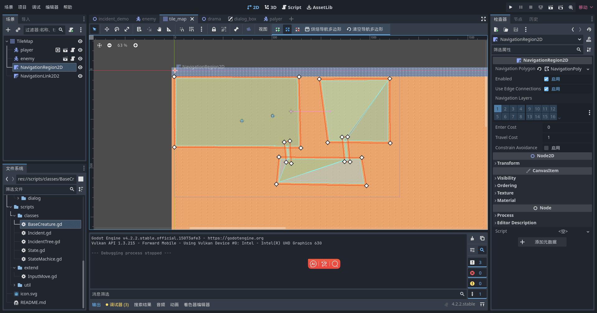

# 监听输入控制移动
监听键盘、鼠标、手柄、触屏等事件进行操控是最常用的功能

## 监听输入
### 监听键盘输入
通过 Input 公共类获取键盘输入(需在项目设置内设置按键映射)
``` gds
static func catch_input_move(speed: int) -> Vector2:
	velocity = Vector2.ZERO # 移动向量默认设置为0，避免未按键时保持向上一次的方向移动
	if Input.is_action_pressed("move_right"):
		velocity.x += 1
	if Input.is_action_pressed("move_left"):
		velocity.x -= 1
	if Input.is_action_pressed("move_down"):
		velocity.y += 1
	if Input.is_action_pressed("move_up"):
		velocity.y -= 1
    return velocity.normalized() * speed
    
```
也可以用 get_axis 获取两个输入的正负值
``` gds
static func catch_input_move(speed: int) -> Vector2:
    velocity = Vector2.ZERO # 移动向量默认设置为0，避免未按键时保持向上一次的方向移动
    velocity.x = Input.get_axis("move_left","move_right")
	velocity.y = Input.get_axis("move_up","move_down")
    return velocity.normalized() * speed # 归一化向量后乘以速度获得移动的方向和距离
```

### 监听鼠标输入
通过内置方法 _input(event) 获取鼠标输入 (需在项目设置内设置鼠标点击映射)
```
func _input(event :InputEvent) -> void:
    if event.is_action("mouse_left"):
        get_global_mouse_position() # 获取鼠标坐标

# 可以通过 _unhandled_input 监听其它组件挑剩下的事件
func _unhandled_input(event :InputEvent) -> void:
    if event.is_action("mouse_left"):
        get_global_mouse_position() # 获取鼠标坐标
    get_viewport().set_input_as_handled() # 释放事件，避免继续传递
```

## 实现控制
控制角色向指定方向移动或移动到目标点

### 角色向某个方向平移
脚本继承自 CharacterBody2D 的节点，绑定在角色上。
通过更改移动速率改变角色的移动方向和速度
``` gds
func _physics_process(delta) -> void:
    ... # 获取键盘输入的移动速率
    
    if velocity.length() <= 0:
        return position # 向量为0，不改变位置
    
    # 通过更改 position 坐标进行移动(不推荐)
    var boundary = get_viewport_rect().size # 获取屏幕边界，避免移动超出屏幕
    velocity = velocity.normalized() * speed    # 归一化向量后再乘以速度，避免斜角移动时速度过快
    position += velocity * delta                # 根据经过的物理帧改变坐标
    position.x = clamp(position.x, 0, boundary.x) # x轴边界检测
    position.y = clamp(position.y, 0, boundary.y) # y轴边界检测
    move_and_slide() # 平滑移动
    
    # 通过更改移动速率使用 move_and_slide 移动
    velocity = InputMove.catch_input_move(speed)
    move_and_slide() # move_and_slide 内部已经计算过速率，因此不需要乘以 delta
    
    # move_and_collide 需要乘以 delta
    velocity = InputMove.catch_input_move(speed) * delta
    move_and_collide(velocity)
```

### 通过 NavigationAgent2D 节点导航到目标点
``` gds
navigation_agent_2d.target_position = get_global_mouse_position() # 设置目标点坐标，可以是鼠标位置或者要追踪对象的位置

func _physics_process(delta) -> void:
    # 距离目标点距离大于1时，使用NavigationAgent2d进行导航，否则停止移动
	if int(navigation_agent_2d.distance_to_target() > 1):
        # 获取下一个路径坐标，将相对于场景原点的全局坐标转换为相对于当前节点的本地坐标并进行归一化处理
		var direction = to_local(navigation_agent_2d.get_next_path_position()).normalized()
		velocity = direction * speed
		move_and_slide()
	else:
		velocity = Vector2.ZERO
```

使用 NavigationAgent2D 进行导航需要在地图场景中添加 NavigationRegion2D 划定导航区域，选择烘焙导航多边形后便可以在区域内进行导航了。
不同的导航区域可以使用 NavigationLink2D 节点进行连接，或者划定一块导航区域将不同的区域进行连通，角色便可以随着通道导航到不同的区域

