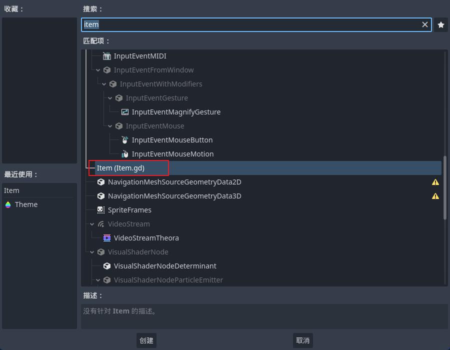
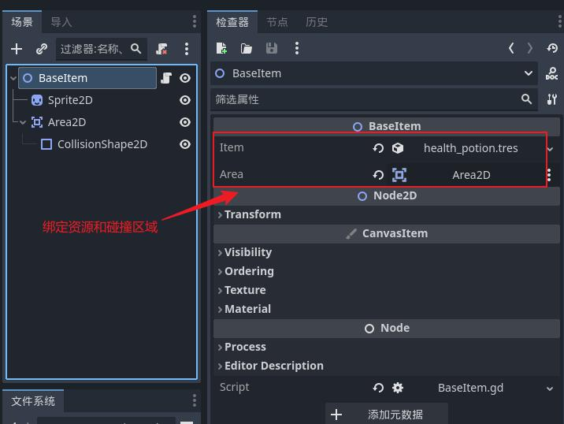

# 物品数据管理

### 功能概述

| 文件名 | 类型 | 描述 |
|--    |--    |--    |
| Item.gd | 物品资源类 | 定义物品数据格式 |
| health_potion.tres | 物品资源 | 从 Item.gd 创建的资源，配置物品数据 |
| health_potion.tscn | 物品场景 | 包含物品图标、动效。碰撞区域等信息 | 
| BaseItem.gd | 物品基类 | 绑定进入碰撞区域信号，管理物品的碰撞、拾起、销毁过程 | 


### 使用方法
假设 item_manage 和 Item 已经创建完成


1. 在文件系统中右键创建资源，选择 Item.gd 资源类创建物品资源
2. 创建物品场景，选择 BaseItem 作为根节点
2. 添加 Sprite2D 等物品展示内容
3. 添加 Area2D 碰撞区域
4. 绑定物品资源，如：health_potion.tres
5. 绑定 Area2D 碰撞区域
6. 配置 Area2D Collision 确保 Mask 层与需要互动的角色的 Layer 层相同


### 实现逻辑

1. 创建一个物品资源类，包含了物品的基本信息 
```
class_name Item extends Resource

@export var name: String
```

2. 新建一个资源，选择创建好的 Item 资源类



3. 添加 BaseItem 基类，当角色进入碰撞区域后将物品资源传递给角色，然后将自身释放。
```
class_name BaseItem extends Node2D

@export var item: Item
@export var area: Area2D

func _ready():
	# 绑定触碰区域
	area.body_entered.connect(_on_area_2d_body_entered)
	#var instance = item.scene.instantiate()
	#add_child(instance)
	
func _on_area_2d_body_entered(body):
	# 检查触碰对象是否定义了拾起 healfh_potion 的函数
	if body.has_method("on_item_picked_up"):
		# 如果有则调用这个方法将物品的KEY传过去，对方可以从物品字典或者资源中获取被拾起物品的 resources 信息
		body.on_item_picked_up(item)
		# 将被拾起的物品从场景中移除
		queue_free()

```

4. 创建物品场景


5. 在 player 脚本添加 on_item_picked_up 脚本,处理角色碰到物品后的逻辑，可以添加到背包或者恢复生命值等。
```
# 拾起物品，当角色触碰物品时由触碰的物品调用
func on_item_picked_up(item: Item):
	print("item_up: ", item.item_id)
```